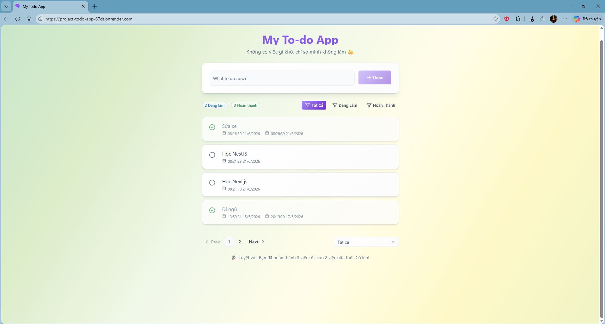

# Todo App - A Task Management System

A simple, full-stack task management application built with the MERN stack. The project allows users to manage daily tasks through a clean interface and provides features such as task filtering, pagination, and statistical summaries.

## Overview

This project was developed to practice full-stack web development using MongoDB, Express.js, React, and Node.js. It demonstrates the implementation of RESTful APIs, database operations, frontend state management, and common application features found in real-world task management systems.

## Tech Stack

### Frontend
- React
- Axios
- React Router

### Backend
- Node.js
- Express.js

### Database
- MongoDB
- Mongoose

## Features

### Task Management
- Create new tasks
- View task details
- Update existing tasks
- Delete tasks

### Filtering
- Filter tasks by status
  - Completed
  - Pending
- Filter tasks by creation time

### Pagination
- Server-side pagination for efficient task listing

### Statistics
- Total number of tasks
- Completed tasks count
- Pending tasks count

## Architecture

Client (React) ➡️ REST API (Express.js) ➡️ MongoDB Database

The frontend communicates with the backend through RESTful APIs. The backend handles business logic and data validation before interacting with MongoDB.

## Learning Objectives

This project was created to gain hands-on experience with:

- RESTful API development
- CRUD operations
- MongoDB data modeling
- Client-server architecture
- Pagination implementation
- Filtering and query handling
- Full-stack application development

## Deploy 

🚀 [Live Demo](https://project-todo-app-67dt.onrender.com/)

## Screenshots

